# 工具概述

##iUAP Studio开发工具概述与关键特性

### 开发工具概述

iUAP Studio是一个简单易用的基于Eclipse开发平台的web项目开发工具。工具集成了eclipse j2ee版本的大部分插件，大大降低了学习成本，并基于iUAP开发平台量身定做了很多实用功能，为WEB应用开发者提供便捷的可视化建模开发，包括快速生成代码块、提供界面友好的可扩展可定制的代码提示窗口、html标签扩展、JS第三方语法支持、页面模式和向导、组件仓库的管理、快速代码生成引擎以及元数据模型设计发布等功能。

### 代码助手，极速编程体验

#### 个性化编辑器:可拖拽的控件工具箱
web页面编辑器左侧提供控件工具箱，点击小箭头可以收起/展开

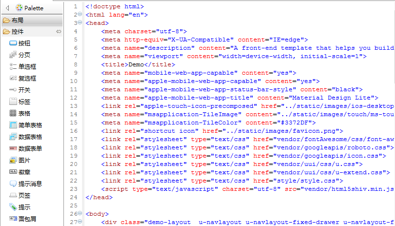

Studio预置了一些html基础控件以及iUAP定制控件，可通过双击或者拖拽的方式插入html页面代码中。 
用户可以也根据需要自定义控件，并使用提供的导入/导出功能完成控件的分享。

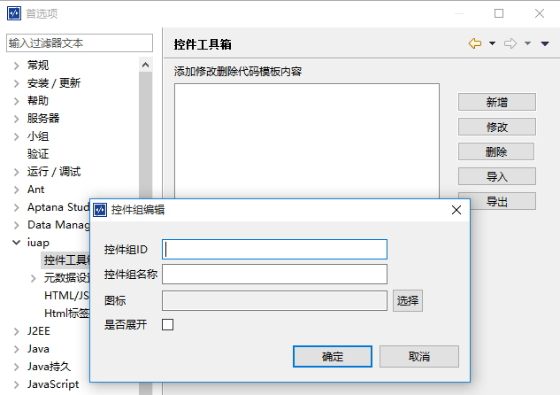

#### 代码智能提示：更快更炫更全

不用输全代码，系统会根据已输入的内容智能弹出提示框，辅助用户进行代码补全。 在补全列表中，可直接使用数字键等快捷键直接选中目标代码。

studio不仅仅提示全面的语法，非语法的各种候选输入也都能提示。包括图片、链接、颜色、字体、脚本、样式、URI、ID、class、自定义JS对象、方法。
举例，在img src=后激活代码助手，可以看到本工程所有图片列表；输入<sc可以看到本工程所有js列表；在js的document.getElementById(id)中提示本工程已经定义的ID列表；在css的color:后可以列出本工程所有使用过的颜色。

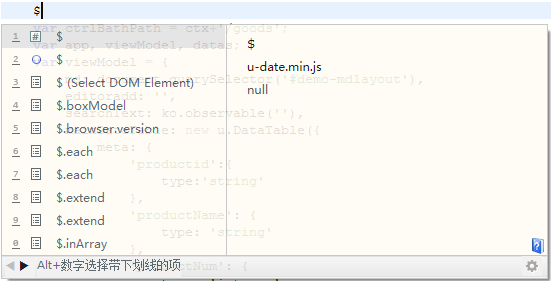

#### 自定义代码块：解放双手，告别重复劳动

可重复利用的代码块可以使用提供的代码块管理窗口录入。提供触发器和代码片段后，即可在智能提示框中使用。

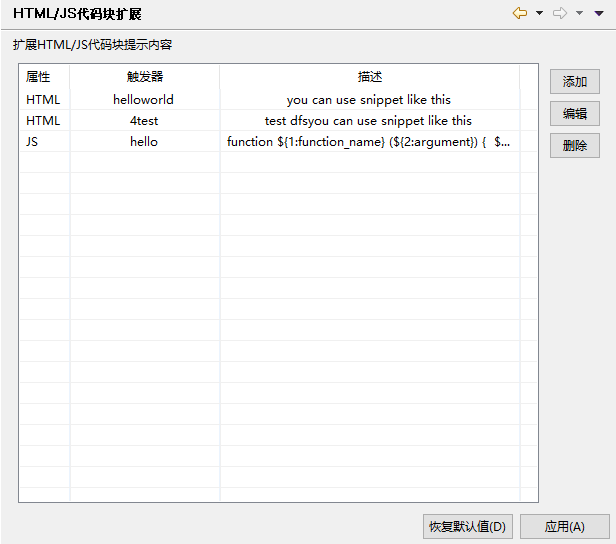

#### JS第三方框架语法支持：前端开发利器

内嵌了jquery、bootstrap、angular、mui等常用框架的语法提示库，并且这些框架语法一样可以享受到智能提示机制，提示图片、颜色、id、class...
如果要使用框架语法，需要在工具菜单/项目的右键菜单中，点击引入框架语法提示的子项，为该项目选择框架语法提示。提示效果如下

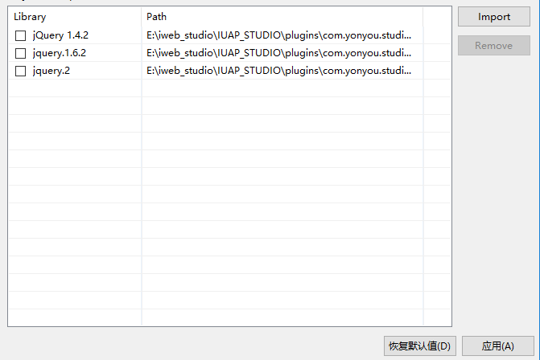

### 模版引擎，没有什么是不能模式化的

Studio提供了丰富的模版内容，这些内容靠模版引擎驱动，除了预置模版之外还支持用户自定义模版内容，以内容来分大概分为工程模版，页面模版和代码模版三类。

#### iUAP工程

studio内置iuap示例工程，通过可通过右键工程或者新建iUAP工程向导完成。 如图所示：

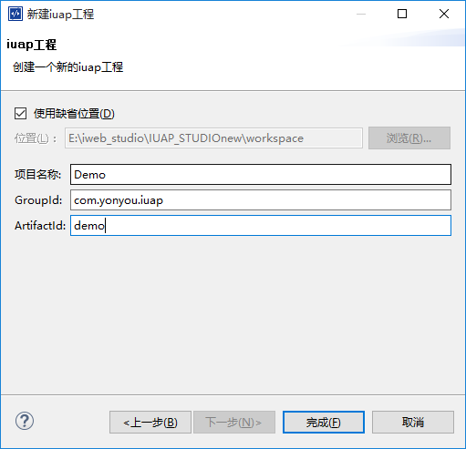
点击完成后， 工作空间内会生成包含iUAP平台基础框架和控件的示例工程，可以直接启动tomcat运行，可以快速预览页面内容。

#### iUAP页面

studio内置iuap标准页面，通过新建iUAP页面向导完成。 可通过右键工程或者新建向导创建。如图所示：
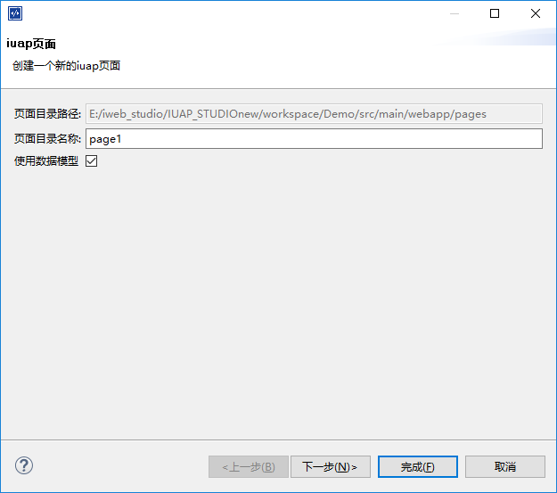

新建iUAP页面有两种类型，一个是标准的不使用数据模型的空页面，一个是使用数据模型的，可以关联iUAP DataTable的数据页面。选择使用数据模型，点击下一步如下：

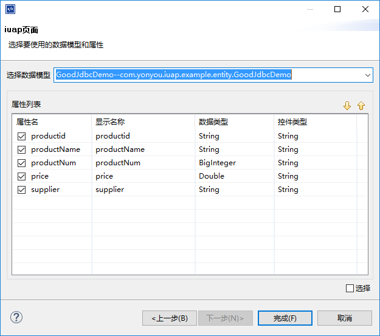

点击完成后会生成html和js类型的两个文件。 用户可在html的div中补充页面内容。 js描述了html页面的动作和数据关联。

#### 页面模版

按领域和功能模块提供了丰富的页面模版。主要是前端页面，包含样式，脚本以及html内容。
根据领域选择中意的页面样式，点击完成即可生成包含完整样式的静态页面。 

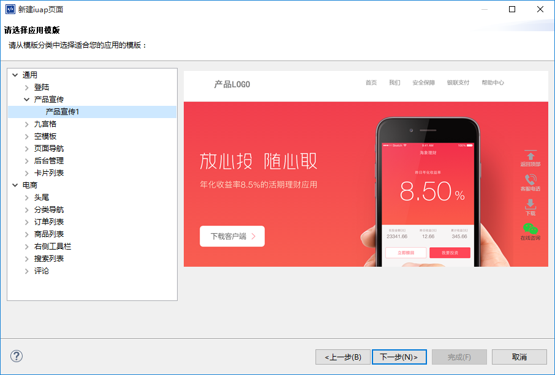

#### 页面预览

使用新建页面完成页面内容或者使用页面模版生成页面后，启动web服务器，右键工程选择页面预览或者点击工具栏中页面预览按钮，可以直接在浏览区预览页面效果。

#### 代码模版

通过选择数据源，勾选需要的实体属性，可以方便的生成基于数据源的后端代码， 预置的模版提供了jpa以及iuap－jdbc方式生成javabean以及DAO的功能。

### 元数据设计器, 最有效率的模型设计工具

模型设计器作为实体模型、数据库模型的定义以及代码生成和脚本生成的工具，为业务系统中的领域模型的建立和基础代码的产生提供了一个完整的平台。

####元数据管理器

元数据管理器是提供元数据的相关管理工具，它支持元数据的创建、数据库导入实体组件、导入元数据bmf文件及删除元数据文件同时方便查看所有模型资源以及公共资源。

####实体操作

对元数据实体的操作可以很直观的在元数据编辑器(画布)上反映出来。 实体组件工具面板上用户通过拖拽的方式，在画布上创建实体组件、创建枚举、创建业务接口、创建注释以及创建关联关系。

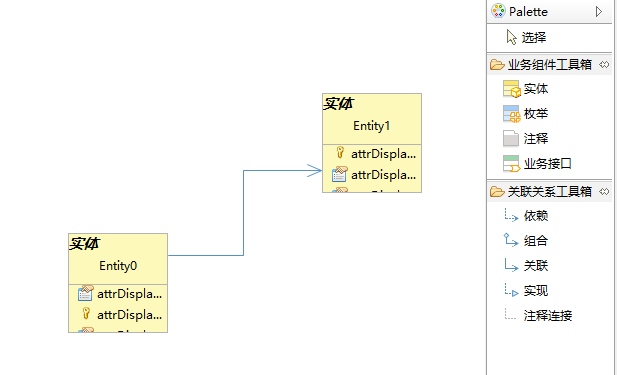
右键点击实体模型弹出菜单，可执行元数据发布，脚本生成，导出代码等实用操作。

### 组件仓库，提供iUAP组件化管理

####组件云商店

提供直连通道连接云端组件库， 直观体现给用户iUAP平台提供的所有组件，并提供组件的下载安装。

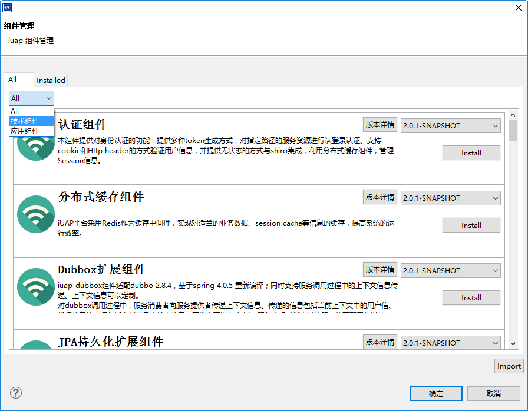

####本地工程组件管理

提供工程相关的组件配置方式，方便用户使用本地组件库中组件。 

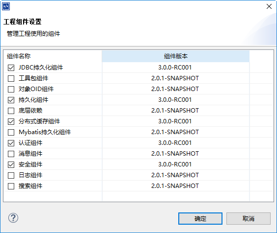

# 功能说明
## iUAP Studio 基本功能说明与应用
### 1. 新建向导
在左侧项目管理器中点击右键，选择新建->项目，进入新建项目向导。
#### 1.1 新建Java工程
向导中选择Java->Java项目，在新窗口中创建你的工程名字，选择你所用的jre环境（这个取决于你电脑上安装的JDK版本），然后点击完成，即可创建普通java工程。 
#### 1.2 新建Spring工程
向导中选择Spring->Spring Project，在新窗口中创建你的工程名，选择相应的工程模版，点击完成，即可创建Spring工程。
#### 1.3 新建Maven工程
向导中选择Maven->Maven Project，在新窗口中选择是否新建普通maven工程(create a simple project)，选择则下一步直接填写groupid及artifactid等，点击完成即可创建maven工程，填写的信息则包含在创建工程的pom文件中。 不选择新建普通maven工程，则下一步可以选择系统提供的maven模版，点击完成新建定制maven工程。

#### 1.4 新建iuap工程
向导中选择iuap->iuap项目或者直接在左侧项目管理器中点击右键，选择新建->iuap项目，在新窗口中点击名称和ArifactId(工程id)，点击完成，即可创建基于iuap示例工程模版的iuap工程。工程中带有若干示例页面和完整的组件信息以及前端uui组件，可以直接启动并在浏览器中预览示例工程页面。

#### 1.5 新建iuap页面
在左侧项目管理器中选择已有的iuap工程， 点击右键，选择新建->iuap页面，新窗口中填写页面名称和id，并选择是否使用数据模型，点击完成即可新建iuap页面（仅在iuap工程中使用）,iuap页面包含html和js文件。

#### 1.6 新建java类(实体类)
在左侧项目管理器中选择已有工程， 点击右键，选择新建->类，建立空白java类，或者新建->JPA Entities from Table，可以根据数据表新建基于数据库字段的javaBean。

### 2. 工程导入
在左侧项目管理器中点击右键，选择导入->导入，进入导入向导。
#### 2.1 已存在的工程导入
此功能提供将已有的eclipse工程导入工作空间，在导入向导中选择导入已有工程，选中要导入的工程目录，在列表框中选择要导入的工程名，点击完成即可。 
#### 2.2 Maven工程导入
此功能提供将已有的maven工程导入工作空间。 在导入向导中选择导入已有maven工程，选中要导入的工程目录，在列表框中选择要导入的工程pom文件，点击完成即可导入工作空间并自动完成编译构建。

### 3. JRE环境配置
工程的编译执行运行时需要JRE的支持，因为studio安装目录里是不带JRE的，因此要使用studio开发首先就要安装好JRE或JDK，然后在studio中配置jre运行时环境。在主菜单中选择窗口->首选项，里面打开Java->Installed JREs，在右侧页面中配置工作空间需要的java运行时环境。

### 4. Maven仓库支持
目前使用maven作为项目管理工具开发的越来越多。studio支持提供对maven的支持。在使用maven的时候，首先要对工作空间的maven进行相应的配置才能够正常使用并且创建maven工程。
#### 4.1 Maven环境配置
maven安装目录下有个config文件夹，在文件夹下有settings.xml文件。settings里面就是配置maven工程的一些本地仓库地址（项目使用的某些jar下载并且安装到本机中），远程仓库（如果本机没有需要的jar，则从远程获取。）的配置等信息。在主菜单中选择窗口->首选项，打开Maven->User Settings配置页， 可以配置所用的maven的settings文件位置，并列出本地仓库地址。
#### 4.2 Maven工程pom配置
打开工作空间中已有的maven工程或iuap工程，双击pom文件，可以打开pom编辑器，在里面可以配置maven工程的groupid,artifactid,版本，打包方式，还有依赖组件等。
#### 4.3 Maven更新
使用pom编辑器更改maven工程信息后，右键点击maven工程，选择Maven->update project，可以按照最新配置更新maven工程，添加新的依赖组件等等。
#### 4.4 Maven构建和启动服务
右键点击maven工程，选择运行方式，子菜单中列出了多种maven的执行命令。其中选择Maven build，在新窗口的Goals文本框中可以自主填写maven命令。如tomcat:run，或者jetty:run，启动tomcat或者jetty服务器。 
### 5.Spring开发套件
#### 5.1 Spring工程模版
新建向导中选择spring project，下一步可选择多种spring工程模版，如spring maven，spring web，spring mvc等。
#### 5.2 Spring工程资源树
建立spring工程后， 左侧项目管理器中显示新建的spring工程，展开工程树结构，显示部署描述符，Spring Elements，JPA content等多种功能节点。 方便对spring工程进行管理。

### 6.Git版本管理支持
#### 6.1 git环境配置
依次点击菜单窗口——首选项——小组——Git——Configuration，点击其中的Add Entry按钮添加用户信息。
这里的Key-Value键值对是提交代码时的备注信息，这里我们可以添加用户名和邮箱等信息。
其中Key中输入User.name, 然后Value中输入用户名，点击OK；这样就将User用户的用户名添加成功了。然后再次点击Add Entry按钮，添加User用户的Email信息，其中Key中写下user.email，Key中输入你的邮箱名，点击OK，此时user用户的邮箱信息即添加完成。当然，你也可以添加其他的备注信息。接下来我们来配置我们的本地Repository。在Eclipse中选中我们要备份的项目，然后依次点击右键——Team——Share Project…此时将打开Configure Git Repository对话框。选中我们要备份的项目，然后点击Create…按钮，选择我们项目Repository的本地存储路径，即本地仓库。点击Finish。此时我们的本地仓库已建立完成。

#### 6.2 从git服务器导出git项目
在项目管理器中，右键选择导入，在导入对话框中，选择“Git”，然后再选择“Projects from Git”。在在弹出的“Import Projects from Git”弹出框中输入“URI”、“Host”、“Repository path”、“User”、“Password”输入框的值，再选择分支和存储路径，点击完成，项目即可在工作空间中加载。

#### 6.3 代码的提交与更新
如果工作空间中有git工程， 打开Git Respositories视图,在此git管理视图中右键点击工程，可选择执行git工程的commit,pull,push等操作。
### 7.JPA持久化规范支持
JPA 充分利用了注释（Annotation）和对象 / 关系映射，为数据持久化提供了更简单、易用的编程方式。studio中提供了对JPA的支持。
#### 7.1 JPA配置
将已有项目添加JPA支持，首先选择项目右键Properties->Project Facets 勾选列表Project Facts 下JPA选项，点击Furhter configuration available，转入数据库连接配置。数据库配置中选择相应类型的数据库和驱动文件，完成主机ip，用户名，密码等信息的录入后，即可完成配置。
#### 7.2 JPA持久化
配置完成后，在项目文件夹上右键选择JPA tools->Generate Entities from Tables，可以执行从数据库创建java实体类或者选择Generate Tables from Entities，执行将javaBean发布到数据库表中。 
### 8.实用编辑器
#### 8.1 java编辑器
双击工程中的java类型文件，可以进入java编辑器。java编辑器提供了代码提示，断点设置，代码重构，打开类层次结构和调用层级结构，抽取方法，格式化元素等多种功能。 

#### 8.2 html编辑器
双击工程中的html，html等类型文件，进入html页面编辑器。html页面编辑器提供了智能代码提示，代码块补全，控件工具箱，html标签扩展，代码块模版扩展等多种功能。

#### 8.3 js编辑器
双击工程中的js文件，进入js编辑器。js编辑器提供智能代码提示，代码块补全，第三方js框架语法引入，代码块模版扩展等功能。

#### 8.4 css编辑器
双击工程中的css文件，进入css编辑器。 css编辑器提供智能代码提示，多种css样式引入，颜色板提示等功能。 

#### 8.5 xml编辑器
双击工程中的xml文件，进入xml编辑器。xml编辑器提供智能代码提示，xml设计等功能。并有xml架构文件编辑器，提供xml文件的模式化生成和实体类的生成。
### 9.服务器支持
Studio中提供对多种服务器的支持。以Tomcat服务器为例。
#### 9.1 服务器配置
点击窗口->首选项->服务器->运行时环境，进入服务器配置页。点击右侧添加按钮，进入服务器选择页。进行若干配置，即可完成。
#### 9.2 服务器视图
点击窗口->显示视图，在视图选择页中选择服务器视图。 在服务器视图中，可以完成服务器的启动和停止。
### 10.数据库支持
#### 10.1 数据库视图
点击窗口->显示视图,选择Data Management->Data Source Explorer, 打开数据库配置视图。 在配置区选择Database Connections，右键New，在新窗口中选择数据库类型和数据库驱动等，并完成主机ip，用户名密码等信息的配置即可。 完成配置后，在数据库视图，可以显示数据库中所有的表信息并提供对数据库的操作。
#### 10.2 工程相关数据库配置
studio为iuap工程提供了专门的数据源配置页。 右键iuap工程，选择iuap tools->数据源配置，在打开的数据源配置对话框中，输入数据库相关信息，并测试连接通过，即可。通过数据源配置页设置的数据源信息保存在application.properties中。
#### 10.3 数据库应用
数据库配置有两块，通过数据库视图中配置的数据库信息是适用于整个工作空间的，在JPA工具进行持久化操作的时候使用。通过iuap tools设置的数据源信息用于iuap工程的启动，浏览和调试以及元数据发布等。
### 11.数据模型引入
开发工具中的数据模型有很多用途，比如绑定控件替换参数，一键生成数据绑定配置文件，页面模式化向导等。 这里的数据模型的概念实际上是基于JavaBean实体类的xml文件，以.model为后缀名。
#### 11.1 新建数据模型
iUAP开发工具提供两种方式生成数据模型。
一是通过数据模型向导直接新建模型。右键工程，选择新建->数据模型。下一步输入模型的名称以及位置，点击完成后，通过model编辑器完成模型的录入。
二是通过绑定实体类，自动生成数据模型。 初始步骤同上，在输入模型名称后点击下一步，进入属性配置页面。 选择需要的实体类以及属性后，点击完成即可生成与实体类对应的模型文件。
#### 11.2 数据模型的使用
数据模型可以用来生成数据控件和生成数据页面。
在html编辑器控件工具箱中拖放数据表格等控件，可以绑定数据模型，生成基于数据模型的代码块
在新建iuap页面功能中，点击使用数据模型，可以绑定数据模型，生成基于数据模型的iuap页面。
### 12.页面模版与代码模版
#### 12.1 根据模版新建页面
点击工具栏新建->iUAP页面模版,可以使用页面模版创建页面。 studio初始安装后， 预置了通用和电商两个领域类别的模版，包含了近30套页面。用户可以根据场景选择模版，点击下一步，输入页面名称即可完成，生成的页面默认放在工程下的src/main/webapp/pages目录中。
用户也可以根据已有页面生成可用模版。在pages下已完成的页面目录点击右键，选择iUAP Tools->生成页面模版，进入页面模版生成向导。 填写完成名称，分类等信息后，点击完成模版会生成在指定位置。这时，可以在新建->iUAP页面模版中可以看到刚导出的页面模版了。
#### 12.2 快速代码生成向导
代码片段通过代码块模版生成，前端页面通过页面模版生成，后端代码则可以通过快速代码生成实现。 右键点击工程，选择iUAP Tools->快速代码生成， 进入代码生成向导。 首先选择数据源，这里有两种方式， 从元数据导入和从数据库导入。
### 13.元数据设计器
#### 13.1 元数据管理视图
元数据管理器是提供元数据的相关管理工具，它支持元数据的创建、数据库导入实体组件、导入元数据bmf文件及删除元数据文件同时方便查看所有模型资源以及公共资源。
#### 13.2 元数据编辑器
模型编辑器器是一个图形化的工具，画布工具便于使用者进行类图建模的绘制。使用者从工具面板中拖动相应元素到画布类图中创建实体、枚举、值对象等。并可对类图中的对象进行直接增、删、改操作。
#### 13.3 元数据的发布和生成建库脚本
元数据编辑器中选定类图中对象后点击鼠标右键可以进行导入属性、发布元数据、发布元数据（忽略版本）、删除发布元数据、生成java源代码、导出pdm(.xml)文件等功能。也可以在元数据管理器中右键点击元数据文件，实现上述功能。
### 14. 组件管理
iUAP平台为组件化管理。 把基本功能按照组件拆分。通过maven仓库管理组件。Studio通过可视化界面， 提供maven组件的下载安装管理
#### 14.1 组件仓库
点击主菜单栏的工具->组件仓库，打开“组件商店”。连接官网提供的组件仓库，按分类显示所有组件的详情描述，并提供下载安装按钮
#### 14.2 工程组件管理
右键点击工程，选择iUAP Tools->工程组件。 显示本地所有已安装的iUAP组件。 并通过勾选组件决定工程是否使用本地组件。 
### 15.中间件启动和页面预览
通过服务器视图，选择已经配置的服务器，可以完成服务器的启动，或者通过右键工程选择运行方式->maven build，在Goals中填写tomcat:run或者jetty:run,启动tomcat或者jetty服务器。启动完成后，如果是iuap工程，还可以实现页面预览功能。 右键点击pages目录下的page，选择iuap tools->页面预览，可以在浏览器中直接预览页面。 

### 16.搜索和替换
studio提供对整个工作空间或者单个工程或文件的搜索和替换功能。点击主菜单的search->搜索菜单，进入功能对话框。

### 17.安装和更新
studio提供新插件的安装以及studio的自动更新功能。 点击主菜单帮助->安装新软件，在work with中输入插件在线更新地址，点击enter，然后选择插件，点击下一步进行安装，或者选择帮助->Eclipse Marketplace,打开插件商店，可以搜索需要的插件进行安装。
工具可以在启动时自动检查更新，或者点击帮助->检查更新手动执行studio更新，我们会定期更新工具的最新功能和模版.
### 18.授权管理
此功能需要配合license服务器使用。在license服务器中导入授权后，点击主菜单帮助->授权管理，在窗口中填写服务器地址、端口，并选择产品进行授权。不授权可以免费使用6个月， 授权后在授权管理窗口可以看到授权有效期。
### 19.帮助内容
点击主菜单->帮助->帮助内容，可以查看studio相关帮助信息。
