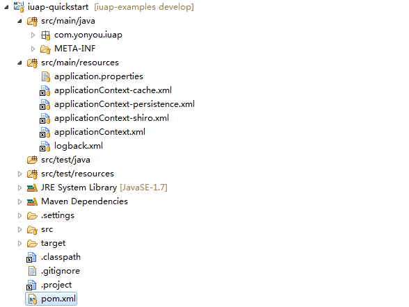
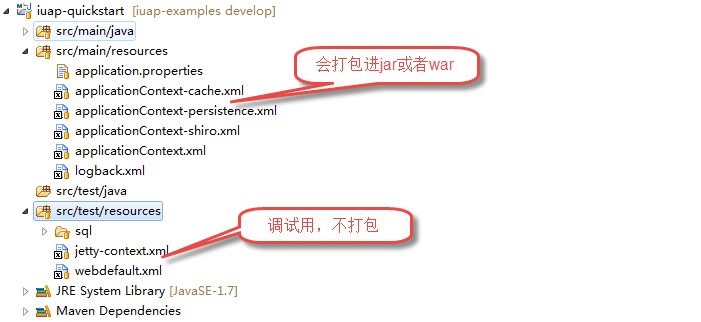
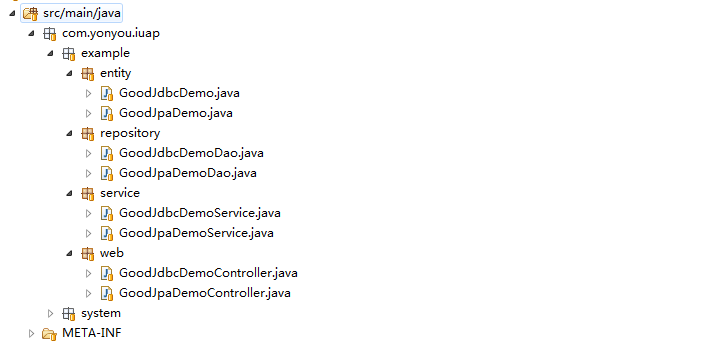

# 前端目录规范

iUAP平台组件和示例工程均采用Maven来构建、管理，推荐使用Maven工程的标准工程结构来组织。

## 1.1 后端工程基本结构

<table>
   <tr>
      <td>目录结构</td>
      <td>描述</td>
   </tr>
   <tr>
      <td>src/main/java</td>
      <td>工程的java源码文件</td>
   </tr>
   <tr>
      <td>src/main/resources</td>
      <td>源码资源文件，比如：配置文件、多语资源文件等</td>
   </tr>
   <tr>
      <td>src/main/filters</td>
      <td>过滤器资源目录，解决多套环境开发配置问题</td>
   </tr>
   <tr>
      <td>src/main/webapp</td>
      <td>web资源目录，与最终生成的war包结构一致</td>
   </tr>
   <tr>
      <td>src/main/metadata</td>
      <td>iUAP元数据资源文件</td>
   </tr>
   <tr>
      <td>src/test/java</td>
      <td>测试用例的源码文件</td>
   </tr>
   <tr>
      <td>src/test/resources</td>
      <td>测试用例的资源文件</td>
   </tr>
   <tr>
      <td>src/test/filters</td>
      <td>测试用例的过滤器</td>
   </tr>
   <tr>
      <td>src/it</td>
      <td>集成测试代码所在的目录，主要是供别的插件使用</td>
   </tr>
   <tr>
      <td>src/assembly</td>
      <td>组件（Assembly）描述符所在的目录</td>
   </tr>
   <tr>
      <td>src/site</td>
      <td>站点文件</td>
   </tr>
   <tr>
      <td>LICENSE.txt</td>
      <td>项目的许可文件</td>
   </tr>
   <tr>
      <td>NOTICE.txt</td>
      <td>该项目依赖的库的注意事项</td>
   </tr>
   <tr>
      <td>README.txt</td>
      <td>项目的readme文件</td>
   </tr>
   <tr>
      <td></td>
   </tr>
</table>

工程统一采用UTF-8编码，配置文件、属性配置文件统一采用UTF-8编码。示例如下：
 
注意事项：
1：src/main/resources包下的配置文件和属性文件会在maven打包的时候，打入到对应的jar包或者war包中，jar类型的组件中，尽量不要将配置文件打入jar包，请开发人员注意。如果是调试类型的配置文件，如jetty-context.xml、webdefault.xml等，建议放置在src/test/resources下，如下图：
 
2：pom文件中引用依赖时候注意，尽量同group下的组件，以属性的形式定义版本，避免切换版本时候多处修改
 
3：项目上如果遇到三方依赖组件的版本冲突问题，需要手动调整排除的组件，保证最终打包产品的三方组件无重复版本。可以借助工具中的pom文件的依赖关系查看来解决。
 

## 1.2 Web目录结构

<table>
   <tr>
      <td>一级目录</td>
      <td>二级目录</td>
      <td>三级目录</td>
      <td>含义</td>
   </tr>
   <tr>
      <td>style</td>
      <td></td>
      <td></td>
      <td>样式文件目录</td>
   </tr>
   <tr>
      <td></td>
      <td></td>
      <td>global.css</td>
      <td>全局公共样式文件</td>
   </tr>
   <tr>
      <td></td>
      <td>default</td>
      <td></td>
      <td>默认皮肤样式</td>
   </tr>
   <tr>
      <td></td>
      <td></td>
      <td>css</td>
      <td></td>
   </tr>
   <tr>
      <td></td>
      <td></td>
      <td>images</td>
      <td></td>
   </tr>
   <tr>
      <td></td>
      <td>theme1 </td>
      <td></td>
      <td>皮肤1</td>
   </tr>
   <tr>
      <td></td>
      <td>theme2</td>
      <td></td>
      <td>皮肤2</td>
   </tr>
   <tr>
      <td>vender</td>
      <td>jquery、bootstrap等</td>
      <td></td>
      <td>各种前端框架的存放位置，包括jquery,bootstrap等</td>
   </tr>
   <tr>
      <td></td>
      <td>uui</td>
      <td></td>
      <td>iUAP前端框架</td>
   </tr>
   <tr>
      <td>config</td>
      <td></td>
      <td></td>
      <td>配置文件目录，如放置requirejs的配置文件</td>
   </tr>
   <tr>
      <td>components</td>
      <td>comp1</td>
   </tr>
   <tr>
      <td>（公共应用组件）</td>
      <td>css</td>
      <td>组件样式文件</td>
   </tr>
   <tr>
      <td></td>
      <td></td>
      <td>js</td>
      <td>私有第三方框架</td>
   </tr>
   <tr>
      <td></td>
      <td></td>
      <td>images</td>
      <td>图像文件</td>
   </tr>
   <tr>
      <td></td>
      <td></td>
      <td>themes</td>
      <td>组件皮肤，自己内部处理</td>
   </tr>
   <tr>
      <td></td>
      <td></td>
      <td>res</td>
      <td>国际化资源目录</td>
   </tr>
   <tr>
      <td>pages</td>
      <td>page1</td>
   </tr>
   <tr>
      <td>（应用页面）</td>
      <td>style</td>
      <td>样式目录</td>
   </tr>
   <tr>
      <td></td>
      <td></td>
      <td>res</td>
      <td>国际化资源目录</td>
   </tr>
   <tr>
      <td></td>
      <td></td>
      <td>image</td>
      <td>图片目录</td>
   </tr>
   <tr>
      <td></td>
      <td></td>
      <td>js</td>
      <td>私有第三方框架</td>
   </tr>
   <tr>
      <td>WEB-INF</td>
      <td>lib</td>
      <td></td>
      <td>jar包存放目录</td>
   </tr>
   <tr>
      <td></td>
      <td>classes</td>
      <td></td>
      <td>类编译输出路径</td>
   </tr>
   <tr>
      <td></td>
      <td>conf</td>
      <td></td>
      <td>配置文件预留目录，采用Spring的配置文件方案，建议放在WEB-INF的classes目录|</td>
   </tr>
   <tr>
      <td></td>
      <td>temps</td>
      <td></td>
      <td>临时生成文件的放置位置</td>
   </tr>
   <tr>
      <td></td>
      <td>templates</td>
      <td></td>
      <td>模板</td>
   </tr>
   <tr>
      <td>index.html</td>
      <td></td>
      <td></td>
      <td>系统首页</td>
   </tr>
   <tr>
      <td>static</td>
      <td></td>
      <td></td>
      <td>公共静态资源目录</td>
   </tr>
   <tr>
      <td>util</td>
      <td></td>
      <td></td>
      <td>公共工具类目录</td>
   </tr>
   <tr>
      <td></td>
   </tr>
   <tr>
      <td></td>
   </tr>
</table>

说明：
（1）本目录结构是指站点的标准目录结构，与java工程下的src/main/webapp对应
（2）本目录是针对已经编译完成的前端资源，前端工程目录不尊从该目录规范

示例结构如下：
 
