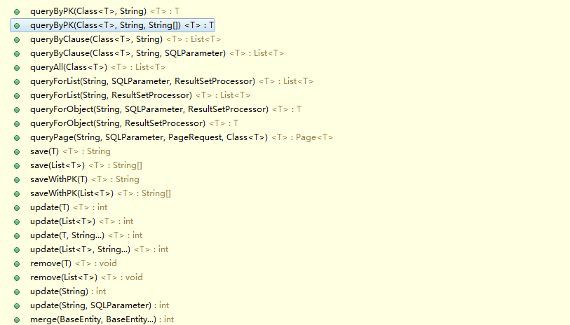
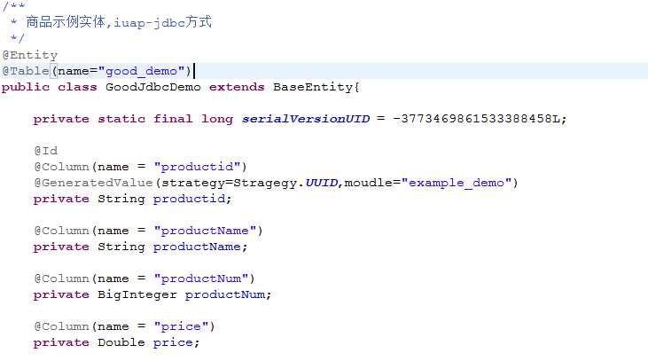
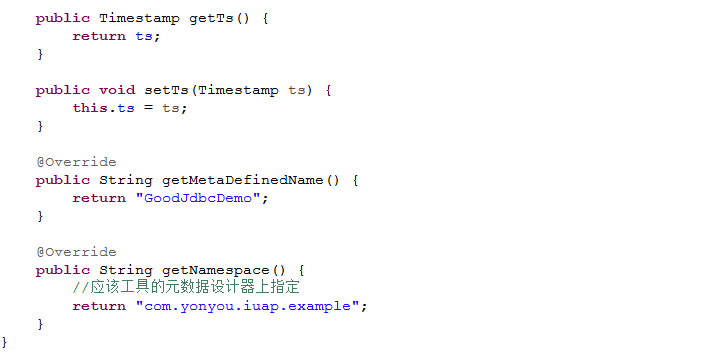
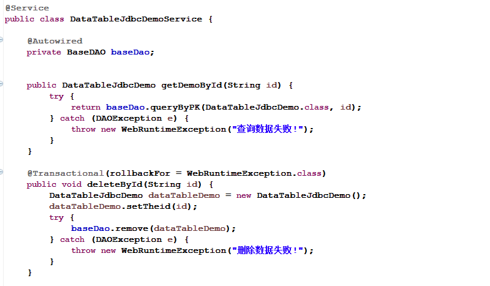
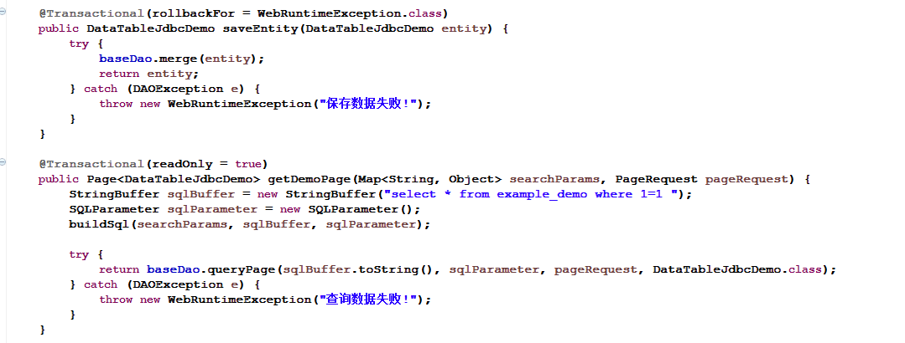
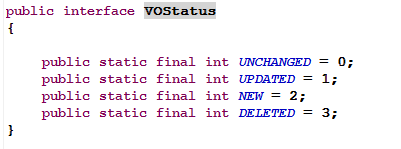

# iuap JDBC方式持久化

iuap JDBC简介
iuap JDBC是基于JDBC的持久层框架，遵循基本的JPA规范，提供对数据的增删改查，分页等功能。提供了基础sql功能，sql基于SQLServer语法，能够提供对多数据库的支持，目前支持的数据库包括：SQLServer,MySQL,Oracle,DB2,Postgresql。

## 3.3.2 iuap JDBC配置

（1）数据源配置如下：

 

（2）配置Spring事务

 

（3）配置BaseDAO

（4）如果配置使用元数据，需要在resources目录下增加配置文件jdbc.properties

 

## 3.3.3 iuap JDBC使用

（1）配置maven依赖

 

其中版本号iuap.modules.version为指定的日志组件的版本，可以从maven仓库总获取适当的版本，例如2.0.1-SNAPSHOT。

（2）BaseDAO的API如下：

 

（3）实体类的声明方式，继承BaseEntity，注意注解是使用的iuap-jdbc组件中的注解。

 

iuap-jdbc为了预留对元数据的扩展，要求必须实现getMetaDefinedName和getNamespace方法，利iuap Studio可以自动生成，如果手动编写，请注意返回值。

 

利用iuap平台的基础组件对pojo等实体数据进行持久化时候，需要生成唯一标识，使用者可以利用数据库提供的序列、自增等方案生成，也可以根据iuap平台提供的OID组件利用API生成，平台提供的组件中默认提供了几种常用的方法来生成OID，例如UUDI、Redis的自增、uapoid，snowflake等算法。通过简单的配置和依赖引用，业务开发人员可以对工程总需要生成主键的代码进行规范，以便实施和扩展时候对分表规则等功能的支持。
对应的主键生成策略@GeneratedValue,提供了UUID，REDIS，SNOWFLAKE、iuapOID、SAASOID和自定义方式。具体配置参考iuap-oid技术组件的介绍。

（4）持久化接口的使用

 
 

（5）主子表持久化

1）实体必须为BaseEntity的子类，并且设置了status。status相关常量

 

2）子表需要声明外键@FK

 

3）调用BaseDAO的merge方法，传入参数，完成主子表的持久化。
