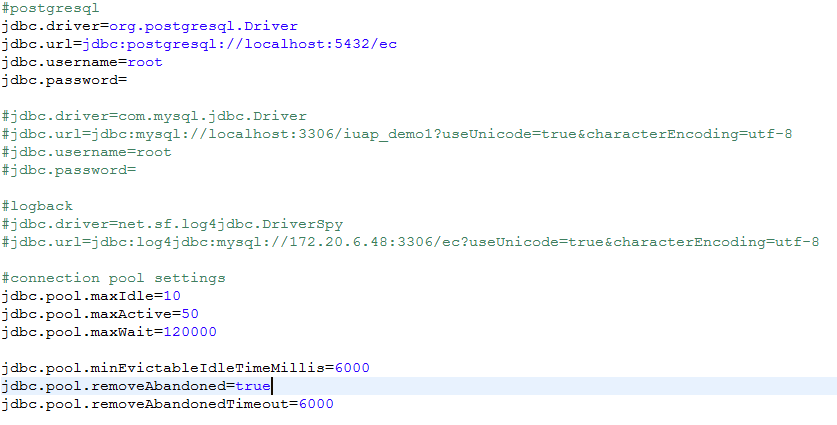
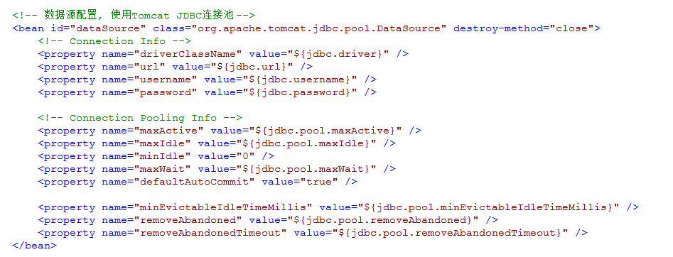
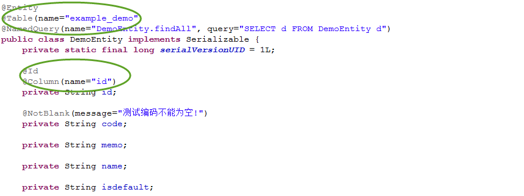

# JPA方式持久化

Spring Data是一个用于简化数据库访问，并支持云服务的开源框架。Spring Data JPA是由Spring Data提供的一个用于简化JPA开发的框架。
使用Spring DataJPA可以极大的简化JPA的写法，可以在几乎不用写实现类的情况下，实现对数据的访问和操作。除了CRUD外，还包括如分页、排序等一些常用的功能。

Spring Data JPA提供的主要接口：

	1：Repository：顶层的接口，统一所有Repository的类型，让组件扫描的时候自动识别。
	2：CrudRepository ：Repository的子接口，提供CRUD的功能。
	3：PagingAndSortingRepository：CrudRepository的子接口，添加分页和排序的功能
	4：JpaRepository：是PagingAndSortingRepository的子接口，增加了一些实用的功能，比如：批量操作等。
	5：JpaSpecificationExecutor：负责查询的接口
	6：Specification：Spring Data JPA提供的一个查询规范，要做复杂的查询，需围绕这个规范来设置查询条件。
    
iuap平台引入Spring Data JPA框架，底层采用Hibernate实现，与Spring集成，配合事务管理器等完成简单业务的持久化与查询操作。

## 3.1.1 JPA配置

（1）maven配置

maven的依赖配置如下图，其中版本号iuap.modules.version为指定的日志组件的版本，可以从maven仓库总获取适当的版本，例如2.0.1-SNAPSHOT、3.0.0-RC001等。

 

iuap平台提供的持久层组件已经将spring data jpa和hibernate需要的依赖包进行管理，引用的依赖如下：

 

注意：数据库驱动的maven依赖根据业务需要自行引入。

（2）web.xml配置

如果是web应用，需要在web.xml中引入相关的配置文件

 

（3）属性文件配置

数据库的连接信息、用户名密码、连接池信息等，通常是采用属性配置文件的方式利用key-value方式定义，方便部署时候的修改，用户可以根据项目需求，选择自己的数据库类型和驱动。

 

（4）spring文件配置

配置属性文件的位置和包自动扫描：

 

配置数据源，jdbc数据连接池有很多种，包括tomcat jdbc连接池，DBCP连接池，c3p0连接池和阿里提供的druid的连接池，具体使用请参考连接池使用章节。如果使用动态数据源组件，建议使用Tomcat JDBC连接池，以tomcat jdbc连接池为例，配置数据源如下：

 

配置实体管理工厂：

 

配置hibernate适配和方言处理：

 

配置spring data jpa：

 

配置事务管理器和注解支持：

 

##  3.1.2 JPA使用

（1）编写实体类

实体类使用简单java对象即可，pojo类可以手动编写，也可以使用jpatools依据数据表自动生成，生成后的实体类再根据业务需要简单调整。

 

（2）编写DAO层

数据库操作类所在的包，在spring配置工厂的时候已经设置，会自动扫描，此包内的类会自动加入到spring管理。可以使用jpql语言查询，也可以配置native sql的查询和更新方式。开发者只用编写接口即可。

（3）使用示例

在需要使用持久化的服务类中，直接使用注解注入Dao即可，spring data 会在运行态使用动态代理的方式生成实现类。

