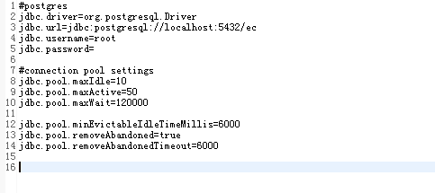
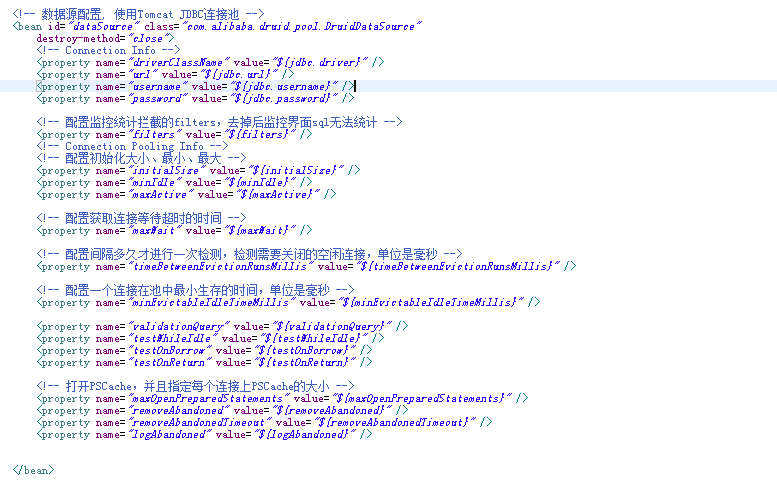
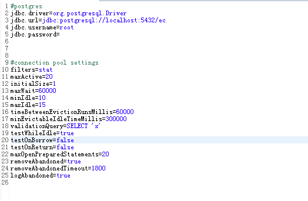
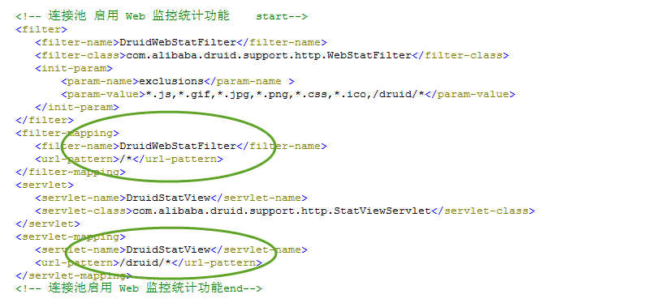
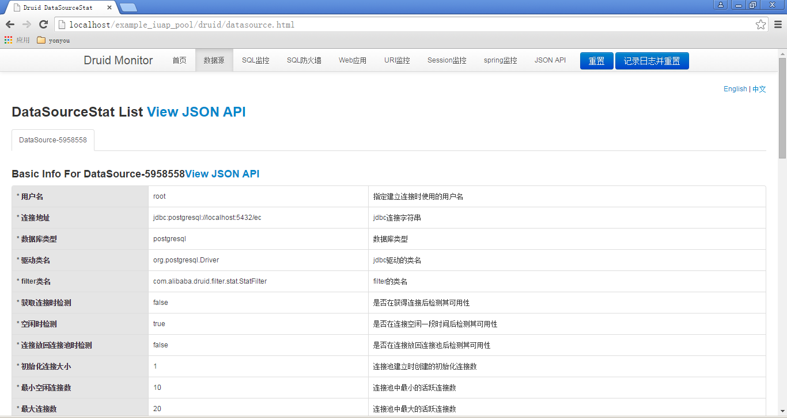

# 数据库连接池

iuap平台默认使用Tomcat Jdbc作为数据库连接池。

Tomcat jdbc连接池兼容dbcp，性能更高。以异步方式获取连接tomcat jdbc pool 是 tomcat 的一个模块，基于 tomcat JULI，使用 Tomcat 的日志框架。支持高并发应用环境，应用简单方便支持 JMX、支持 XA Connection。

## 4.2.2 数据库连接池配置

Tomcat数据库连接池需要引入maven依赖如下，如果引入iuap-persistence会简介引入：

 

数据源的配置如下：

 

Tomcat数据库连接池属性配置：

 

 Druid也是较好的数据库连接池，在功能、性能、扩展性方面，都超过其他数据库连接池，如DBCP、C3P0、BoneCP、Proxool、JBossDataSource。Druid已经在阿里巴巴部署了超过600个应用，经过一年多生产环境大规模部署的严苛考验。Druid提供了数据库访问性能的监控、DBCP和C3P0替换、数据库密码加密、SQL执行日志、扩展JDBC等功能。
 
Druid连接池需要引入jar包，druid-1.0.16.jar，Druid数据库连接池配置：

 

Jdbctemplate与Druid数据源绑定配置：

 

Druid数据库连接池属性配置：

 

## 4.2.3 数据库连接池使用

DataSource配置好之后，JPA方式、Mybatis、JDBC方式的连接自动从连接池中获取，业务开发时候不需要关心，直接调用即可。

 

Druid连接池提供监控界面，需要在web.xml中进行配置，如下：

 

	监控界面中提供大量的信息，可以方便的查看慢sql等信息，帮助开发人员进行性能分析，界面如下：
 

## 4.2.4多种数据源的适配

### 4.2.4.1 JPA的适配

	使用Spring Data JPA方式，除了在注解上使用的本地sql方式外，会适配多种数据库，不需要做太多修改，需要业务开发时候，使用标准的JPQL语法即可。在配置文件中，指定方言的配置为：

 

    iuap平台提供的方言控制类已经提供了绝大多数常用数据库的配置，如果需要对特殊数据库进行配置，需要对应的扩展。

### 4.2.4.2 MyBatis的适配

	Mybatis对应的映射文件编写时候使用的是针对某种数据库的语法，如果需要兼容多种数据库，需要在对应的配置文件的目录编写针对性的配置文件，mapper映射文件的名称保持相同即可，可以在制定mapper映射文件的时候，以数据库类型的文件夹名称区分，例如将mysql对应的mapper映射文件放置在mybatis/mysql，目录下，修改指定的位置即可。
 
 

### 4.2.4.3 UAP JDBC的适配

（1）数据源配置如下：

 

（2）配置Spring事务

 

（3）配置BaseDAO

 

（4）如果配置使用元数据，需要在resources目录下增加配置文件jdbc.properties

 
