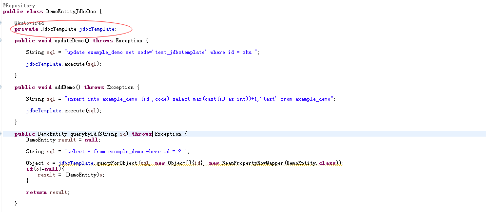
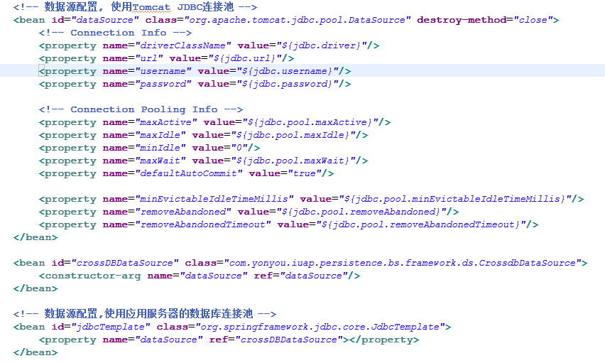

# 数据库连接池

iuap 平台默认使用Tomcat JDBC作为数据库连接池。Tomcat JDBC连接池兼容DBCP，使用简单方便，性能更好，支持高并发的应用环境，同时支持 JMX 以及XA Connection。

## 数据库连接池配置

Tomcat JDBC数据库连接池需要引入maven依赖如下，如果已经引入iuap-persistence组件，tomcat-jdbc会被间接引入，目前使用的版本为7.0.53：

    <!-- connection pool 依赖 -->
    <dependency>
        <groupId>org.apache.tomcat</groupId>
        <artifactId>tomcat-jdbc</artifactId>
        <version>${tomcat-jdbc.version}</version>
    </dependency>

属性文件配置示例如下：

	jdbc.driver=com.mysql.jdbc.Driver
	jdbc.url=jdbc:mysql://localhost:3306/iuap_demo?useUnicode=true&characterEncoding=utf-8
	jdbc.username=root
	jdbc.password=root
	jdbc.defaultAutoCommit=true
	
	#connection pool settings
	jdbc.pool.minIdle=0
	jdbc.pool.maxIdle=20
	jdbc.pool.maxActive=50
	jdbc.pool.maxWait=30000
	jdbc.pool.initialSize=0
	
	jdbc.pool.testOnBorrow=false
	jdbc.pool.validationInterval=30000
	jdbc.pool.testOnReturn=true
	jdbc.pool.validationQuery=select 1
	
	jdbc.pool.testWhileIdle=true
	jdbc.pool.timeBetweenEvictionRunsMillis=30000
	jdbc.pool.numTestsPerEvictionRun=-1
	
	jdbc.pool.minEvictableIdleTimeMillis=60000
	jdbc.pool.removeAbandoned=true
	jdbc.pool.removeAbandonedTimeout=60

持久化对应的spring文件中数据源的配置示例如下：

	<!-- 数据源配置, 使用Tomcat JDBC连接池 -->
	<bean id="dataSource" class="org.apache.tomcat.jdbc.pool.DataSource" destroy-method="close">
		<!-- Connection Info -->
		<property name="driverClassName" value="${jdbc.driver}" />
		<property name="url" value="${jdbc.url}" />
		<property name="username" value="${jdbc.username}" />
		<property name="password" value="${jdbc.password}" />
		<property name="defaultAutoCommit" value="${jdbc.defaultAutoCommit}"/>
	
		<!-- Connection Pooling Info -->
		<property name="maxActive" value="${jdbc.pool.maxActive}" />
		<property name="maxIdle" value="${jdbc.pool.maxIdle}" />
		<property name="minIdle" value="${jdbc.pool.minIdle}" />
		<property name="maxWait" value="${jdbc.pool.maxWait}" />
		<property name="initialSize" value="${jdbc.pool.initialSize}" />
		
		<property name="testOnBorrow" value="${jdbc.pool.testOnBorrow}"/>
		<property name="validationInterval" value="${jdbc.pool.validationInterval}"/>
		<property name="testOnReturn" value="${jdbc.pool.testOnReturn}"/>
		<!--mysql,sqlserver,postgresql使用select 1，oracle使用select 1 from dual-->
		<property name="validationQuery" value="${jdbc.pool.validationQuery}"/>
	
		<property name="testWhileIdle" value="${jdbc.pool.testWhileIdle}"/>
		<property name="timeBetweenEvictionRunsMillis" value="${jdbc.pool.timeBetweenEvictionRunsMillis}"/>
		<property name="numTestsPerEvictionRun" value="${jdbc.pool.numTestsPerEvictionRun}"/>
	
		<property name="minEvictableIdleTimeMillis" value="${jdbc.pool.minEvictableIdleTimeMillis}" />
		<property name="removeAbandoned" value="${jdbc.pool.removeAbandoned}" />
		<property name="removeAbandonedTimeout" value="${jdbc.pool.removeAbandonedTimeout}" />
	</bean>

Druid也是较好的数据库连接池，提供了数据库访问性能的监控、数据库密码加密、SQL执行日志、扩展JDBC等功能，在性能和扩展性方面 也超过DBCP、C3P0等。
 
Druid连接池需要引入jar包，如druid-1.0.18.jar，maven方式引入的示例如下：

    <dependency>
        <groupId>com.alibaba</groupId>
        <artifactId>druid</artifactId>
        <version>1.0.18</version>
    </dependency>

Druid数据库连接池属性文件配置示例：
	
	#mysql
	jdbc.driver=com.mysql.jdbc.Driver
	jdbc.url=jdbc:mysql://localhost:3306/iuap_demo?useUnicode=true&characterEncoding=utf-8
	jdbc.username=root
	jdbc.password=root
	
	#connection pool settings
	filters=stat
	maxActive=20
	initialSize=1
	maxWait=60000
	minIdle=10
	maxIdle=15
	timeBetweenEvictionRunsMillis=60000
	minEvictableIdleTimeMillis=300000
	validationQuery=SELECT 1
	testWhileIdle=true
	testOnBorrow=false
	testOnReturn=false
	maxOpenPreparedStatements=20
	removeAbandoned=true
	removeAbandonedTimeout=1800
	logAbandoned=true

Druid数据库连接池Spring配置文件：

<!-- 数据源配置, 使用Druid连接池 -->
	<bean id="dataSource" class="com.alibaba.druid.pool.DruidDataSource" destroy-method="close">
		<!-- Connection Info -->
		<property name="driverClassName" value="${jdbc.driver}" />
		<property name="url" value="${jdbc.url}" />
		<property name="username" value="${jdbc.username}" />
		<property name="password" value="${jdbc.password}" />

		<!-- 配置监控统计拦截的filters，去掉后监控界面sql无法统计 -->
		<property name="filters" value="${filters}" />
		<!-- Connection Pooling Info -->
		<!-- 配置初始化大小、最小、最大 -->
		<property name="initialSize" value="${initialSize}" />
		<property name="minIdle" value="${minIdle}" />
		<property name="maxActive" value="${maxActive}" />

		<!-- 配置获取连接等待超时的时间 -->
		<property name="maxWait" value="${maxWait}" />

		<!-- 配置间隔多久才进行一次检测，检测需要关闭的空闲连接，单位是毫秒 -->
		<property name="timeBetweenEvictionRunsMillis" value="${timeBetweenEvictionRunsMillis}" />

		<!-- 配置一个连接在池中最小生存的时间，单位是毫秒 -->
		<property name="minEvictableIdleTimeMillis" value="${minEvictableIdleTimeMillis}" />

		<property name="validationQuery" value="${validationQuery}" />
		<property name="testWhileIdle" value="${testWhileIdle}" />
		<property name="testOnBorrow" value="${testOnBorrow}" />
		<property name="testOnReturn" value="${testOnReturn}" />

		<!-- 打开PSCache，并且指定每个连接上PSCache的大小 -->
		<property name="maxOpenPreparedStatements" value="${maxOpenPreparedStatements}" />
		<property name="removeAbandoned" value="${removeAbandoned}" />
		<property name="removeAbandonedTimeout" value="${removeAbandonedTimeout}" />
		<property name="logAbandoned" value="${logAbandoned}" />
	</bean>

## 数据库连接池使用

DataSource配置好之后，Spring Data JPA方式、Mybatis、JDBC方式的连接自动从连接池中获取，业务开发时候不需要关心，直接调用即可。

 

如果使用的是Druid连接池，本身可提供监控界面，需要在web.xml中进行配置，如下：

	<!-- 连接池 启用 Web 监控统计功能-->
    <filter>
       <filter-name>DruidWebStatFilter</filter-name>
       <filter-class>com.alibaba.druid.support.http.WebStatFilter</filter-class>
       <init-param>
           <param-name>exclusions</param-name >
           <param-value>*.js,*.gif,*.jpg,*.png,*.css,*.ico,/druid/*</param-value>
       </init-param>
    </filter>
    <filter-mapping>
       <filter-name>DruidWebStatFilter</filter-name>
       <url-pattern>/*</url-pattern>
    </filter-mapping>
    <servlet>
       <servlet-name>DruidStatView</servlet-name>
       <servlet-class>com.alibaba.druid.support.http.StatViewServlet</servlet-class>
    </servlet>
    <servlet-mapping>
       <servlet-name>DruidStatView</servlet-name>
       <url-pattern>/druid/*</url-pattern>
    </servlet-mapping>

监控界面中提供大量的信息，可以方便的查看慢sql等信息，帮助开发人员进行性能分析，界面如下：
 
 

## 多种数据源的适配

### Spring Data JPA的适配 ###

使用Spring Data JPA方式，除了在注解上使用的本地sql方式外，会适配多种数据库，不需要做太多修改，需要业务开发时候，使用标准的JPQL语法即可。在配置文件中，指定方言的配置为：

 

iuap平台提供的方言控制类已经提供了大多数常用数据库的配置，如果需要对特殊数据库进行配置，需要对应的扩展。

### MyBatis的适配 ###

Mybatis对应的映射文件编写时候使用的是针对某种数据库的语法，如果需要兼容多种数据库，需要在对应的配置文件的目录编写针对性的配置文件，mapper映射文件的名称保持相同即可，可以在制定mapper映射文件的时候，以数据库类型的文件夹名称区分，例如将mysql对应的mapper映射文件放置在mybatis/mysql，目录下，修改指定的位置即可。
 
 

### UAP JDBC的适配 ###

（1）数据源配置如下：

 

（2）配置Spring事务

 

（3）配置BaseDAO

 

