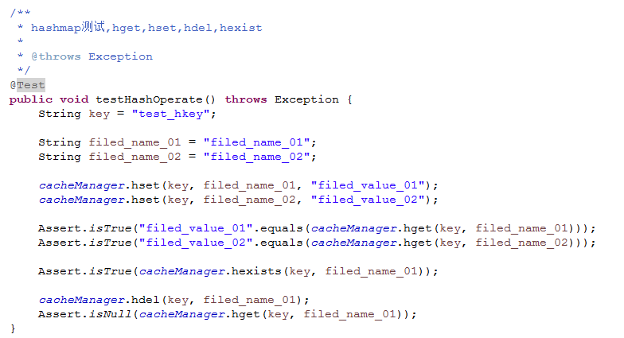

# 组件的集成

iUAP技术组件主要包括认证组件、分布式缓存组件、持久化组件、消息组件、分布式服务组件、文件组件、分布式锁组件、日志组件、对象OID组件、搜索组件、工具包组件等，主要以jar包组件的方式向开发人员提供基础的功能，并配合使用示例和帮助文档帮助业务开发人员快速的搭建基础工程、集成相应的特性。
配合使用iUAP平台的开发工具和示例工程，开发者可以快速的集成如下特性：
1）根据项目需要添加基础的持久化功能，包括JPA方式、Mybatis方式、iUAP jdbc与元数据方式等；
2）集成对分布式缓存的使用，使用简单可配置url的方式连接缓存服务器，调用简单API轻松实现缓存的管理；
3）集成用户的身份认证和无状态的会话信息管理；
4）根据业务需要，集成异步消息处理的功能，支持RabbitMQ和阿里云MNS；
5）为敏感业务功能添加分布式锁的控制，互斥使用共享资源；
6）统一日志的输出规范，方便后续运维管理日志的统计和收集以及在线问题的排查；
7）提供可配置的方式，对FastDFS、OSS的文件进行管理；
8）集成搜索组件，采用搜索引擎来快速查询业务数据，减轻数据库压力；
以上是部分iUAP基础技术组件的功能概要，iUAP平台还提供丰富的应用组件，包括编码规则、业务日志、后台任务调度、电商连接、附件管理、公式服务、打印、支付、分享和三方登录等组件。其他的组件以及使用方式、示例工程，请参考iUAP官网。
除了以web服务提供的组件外，各个技术组件集成的方式类似，下文以iuap-cache组件的集成为示例，介绍一下组件的基本集成过程，更加详细的组件使用方式，请参考官网的开发者社区》开发平台》技术组件部分。
iUAP平台的技术组件和示例工程统一采用maven工程的方式构建，首先需要在自身的工程中，引入对组件的依赖，如下图：
 
在web.xml中引入组件对应的spring的配置文件，如下：
 
在spring的配置文件中，会以变量的方式引入properties文件中的值，所以，需要在spring的主文件中定义对属性文件的引入：
 
	在spring的配置文件中，声明bean，按照组件的示例配置适当调整：
 
    在属性文件中，定义需要引用的变量和值：
 
注意事项：部分组件中会利用java代码从属性文件中利用iuap-util组件中的PropertyUtil类获取键值，默认会从classpath下的application.properties文件读取，如果用户需要修改默认属性文件的位置和名称，需要利用环境变量或者系统属性的方式传入，又或者定义启动的监听，在监听中调用静态方法，指定属性文件的地址和名称，如下：
 
	在业务代码中利用spring的注入，调用bean中的方法即可。注意，如果同类型的bean有多个声明，不能简单用@Autowired注解，请利用@Resource或者其他的方式，使用bean名称的方式注入，如下：
 
 

