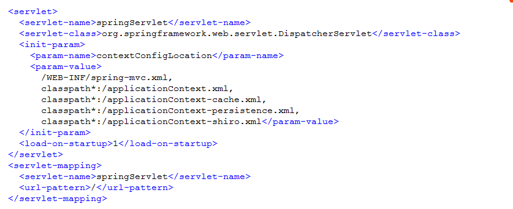

# Restful服务开发

## 7.1.1 Restful简介
RESTful架构，就是目前最流行的一种互联网软件架构。其目的是为了提高系统的可伸缩性，降低应用之间的耦合度，便于框架分布式处理程序，具有结构清晰、符合标准、易于理解、扩展方便，正得到越来越多网站的采用。
REST（ Representational State Transfer）即 "表现层状态转化"。如果一个架构符合REST原则，就称它为RESTful架构。RESTful架构具有以下特征
（1）每一个URI代表一种资源；　　
（2）客户端和服务器之间，传递这种资源的某种表现层；　　
（3）客户端通过四个HTTP动词，对服务器端资源进行操作，实现"表现层状态转化"。
REST服务采用HTTP协议规定的GET、POST、PUT、DELETE等动作处理资源的增删该查操作。
iUAP平台引入了Spring MVC，利用Spring MVC配合注解的方式，提供REST服务，供前端页面调用以及为其他系统或者端提供服务。
## 7.1.2 Restful配置
（1）maven依赖配置
 
其中，spring.version为当前使用的sping的版本，如4.0.5.RELEASE。
（2）web.xml配置
 

（3）spring-mvc.xml配置
配置spring-mvc.xml并且制定扫描的包名，将用注解标识的控制器扫描到容器中。
 

    配置完成后，即可用注解声明控制器，来接收Http请求，如果是open api，需要在制定的url规则上配置过滤器，如拦截/rest和/api的请求，进行签名的验证，通过验证的请求才允许继续访问，Rest服务安全相关问题请参考安全章节。
## 7.1.3 Restful使用
编写Spring MVC的控制器
 
使用@RestController、@RequestMapping、@ResponseBody等接口，声明控制器类路径和返回的内容格式等，前端使用java提交http请求或者js的ajax请求即可调用此方法。
其中方法的返回值可以是java对象，使用@ResponseBody 注解，spring MVC会自动将返回内容适配成json格式，返回格式如下：
 
